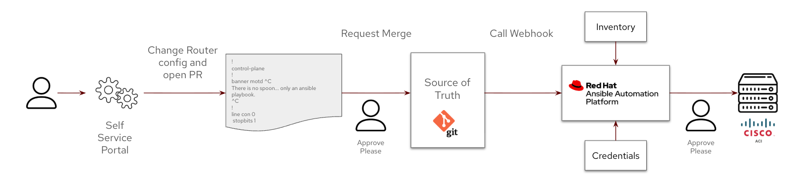
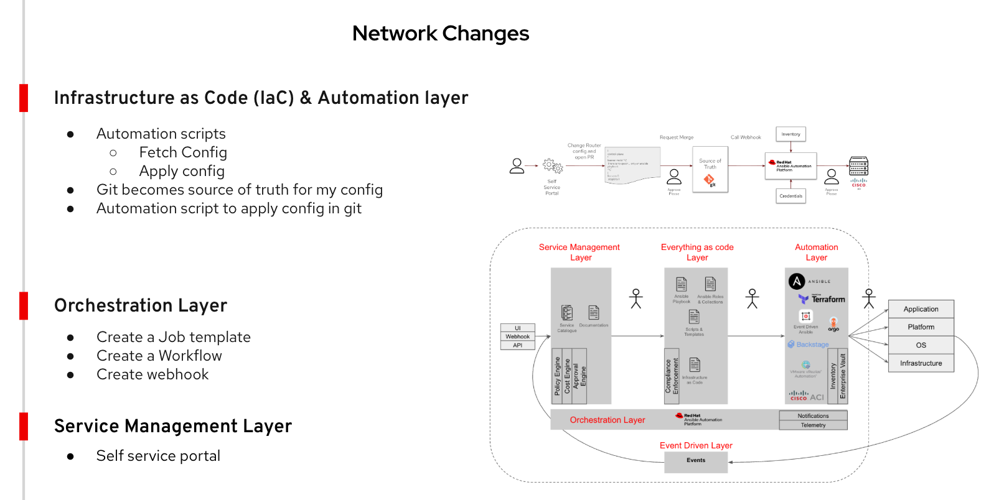

# DUMMY VALUES USED in this repository

cd /Users/arslankhan/Codes/demo.redhat.com/Ansible-AcademySessions/demo-ansible-network

## Git clone and test push

```sh
git clone https://github.com/arslankhanali/demo-ansible-network.git
cd demo-ansible-network

git config --global user.name "Arslan Khan"
git config --global user.email "arslankhanali@gmail.com"

git add .
git commit -m "update motd"
git push


# Gitignore setup
tee .gitignore > /dev/null <<EOL
.*
*.json
backup/
EOL

git rm -r --cached .

# Stash local changes
git stash
git pull
```

### Login to cisco router - CLI
```sh
ssh rtr1
sh run
exit
```

### Login to cisco router - Web
```sh
# Get IP for rtr1
cat /etc/hosts

https://3.137.184.95

# Create an account to login
ssh rtr1

conf t
username admin privilege 15 secret admin
ip http authentication local
end
wr mem
```
---

## Demo Start



Lets start with a use case
See if we can prototype the automation and take inspiration from the framework

Framework is general enough that it should fit any use case
You can pick and choose relevant elements from the framework

Help you think and deconstruct the problem

### 1. Set motd
Show webui and `sh run` command and show the motd if already set.

```sh
ssh rtr1

conf t
banner motd #
Demo for Services Austraila
#
end
wr mem
```

### 2. fetch config
```sh
# Show inventory
ansible-navigator inventory # TUI (Text-based User Interface)
ansible --list-hosts cisco

ansible-navigator run 1-fetch.yaml --mode stdout --pae false
```

### 3. apply config
```sh
ansible-navigator run 2-apply.yaml --mode stdout --pae false
```

### 4. apply config from git
```sh
# Make it a source of truth
git add .
git commit -m "updated motd"
git push

# Apply from Source of truth
ansible-navigator run  --mode stdout 3-apply-git.yaml --pae false

ssh rtr1

```

### 5. AAP: Create project
```sh
Name: Framework-in-action
Organisation: Default
Execution env: network workshop execution environment
source control: git
Source control URL: https://github.com/arslankhanali/demo-ansible-network
branch: main 
```

### 6. Job template
```sh
Name: apply-config-to-router
Inventory: Workshop inventory
Project: Framework-in-action
Execution env: network workshop execution environment
credentials: workshop credentials | Machine

```

### 7. worksflow Job template
```sh
Name: apply-config-workflow
Organisation: Default
Inventory: Workshop inventory

Options
  Enable webhook
  Github
```

### 8. Add Steps
```sh
# Approval
Node type: Approvals
Name: Approve-workflow

# Job templaye
Node type: Job Template
Job template: apply-config-to-router
Status: Run on success
Convergence: Any

```

### 9. Webhook
Go back to workflow jon template and click edit. Copy the 
- Webhook URL
  - https://student1.s2vbd.example.opentlc.com/api/controller/v2/workflow_job_templates/17/github/
- Webhook Key
  - skAQBkd5ECVdYb2sl3731UoU7V9FYHB73QHuCkAeEREUrx86pf

Go to github and add webhook
- https://github.com/arslankhanali/demo-ansible-network/settings/hooks
- Payload URL: https://student1.s2vbd.example.opentlc.com/api/controller/v2/workflow_job_templates/17/github/
- Content type: application/json
- Secret: skAQBkd5ECVdYb2sl3731UoU7V9FYHB73QHuCkAeEREUrx86pf
- SSL verification: Enable (default)
- Which events would you like to trigger this webhook?: Just the push event. (default)
- Check Active (default)


### 10. Open a PR
```sh
git checkout main
git pull

# -b when running for the first time 
git checkout -b update-rtr1-config

# If you already have a branch
git checkout update-rtr1-config
# Change rtr1_config.txt
git add rtr1_config.txt
git commit -m "Update motd"
git push -u origin update-rtr1-config

git checkout main
git pull
```

### 11. Create app
```sh
pip install flask
pip install requests

# app only changes config file locally 
python app.py

# app changes config file locally and pushes changes to a new branch 'update-rtr1-config'
python app3.py

```

### delete
rm *.json
rm -r backup/


### API
https://student1.ml647.example.opentlc.com/api/controller/v2/

curl -u admin:43l7dlaf -k -X POST https://student1.ml647.example.opentlc.com/api/controller/v2/tokens/
